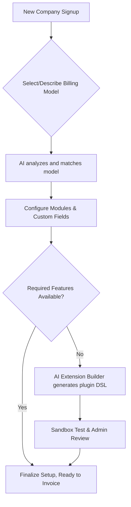
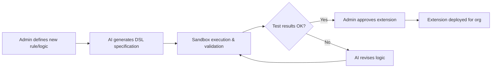
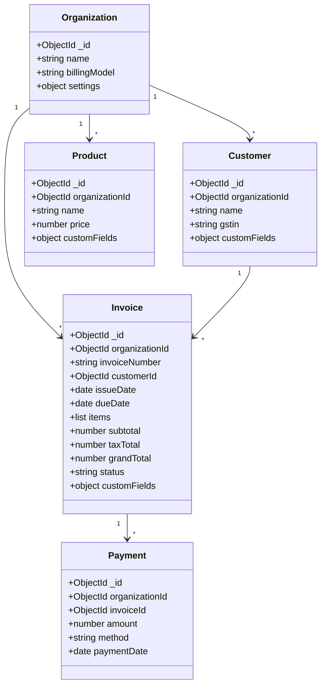

# Executive Summary  
We propose an **Adaptive AI-Powered Multi-Tenant Billing Platform** that serves diverse companies from a single codebase. Unlike traditional invoicing systems, our platform dynamically configures itself for each tenant (company) and can even generate new billing logic on demand using AI. The core idea is to **“configure, not code”** as much as possible. Each new company undergoes an AI-driven onboarding: it selects or describes its business model, and the system matches it to a suitable billing model (e.g. retail, subscription, usage-based, rental, utility, etc.). The platform then loads only the needed modules and custom fields, and sets up workflows, invoice templates, and policies for that company. If a tenant’s requirements exceed existing capabilities, our **AI Extension Builder** generates a controlled plugin (within a secure sandbox) that implements the needed logic, with automated tests and human approval. 

Key innovations include:  
- **Full multi-tenancy**: one deployment serves many companies, with strict data isolation (each document tagged by `organizationId`).  
- **Metadata-driven schema**: tenants can add custom entities/fields via a configuration UI. The backend stores dynamic fields in MongoDB (e.g. each invoice can carry arbitrary custom attributes, with a separate collection of field definitions per company).  
- **AI-assisted setup**: an LLM analyzes the company’s description, matches it to a billing model, configures the initial schema and workflows, and flags gaps. If needed, it generates a declarative rule or plugin spec (not raw code) to extend the system. All AI-generated code runs in an **isolated sandbox** (container or microVM) to prevent any security risk.  
- **Extensible billing engine**: a core “billing engine” handles products, customers, taxes, invoices, and payments with robust rules (discounts, taxes, proration, partial payments, etc.). It uses invoice snapshotting (storing prices in each invoice) to preserve history, and supports complex tax rules (GST/IGST etc.). A formula and rule engine lets us define new charge models without code.  
- **AI features**: Natural-language invoice creation (chat/voice invoice copilot), document OCR/scan (upload a PDF/receipt to create an invoice), payment-delay prediction, anomaly detection (fraud alerts, unusual discounts), smart reminders (personalized messages and timing), and AI query interface (“Ask Your Business”) that answers financial questions by calling our APIs.  
- **Custom invoice templates**: each company can design invoice layouts (logo, colors, fields, table columns, terms). An **AI invoice-designer** can generate a JSON template from a prompt, which users can tweak in a GUI.  

The platform’s **architecture** is modular: an Express.js API serves React frontends; a `billing-engine` module handles core calculations; a `dynamic-config` module manages metadata (fields, entities, rules); an `ai` module orchestrates LLM agents; an `extension-engine` manages plugins. We use MongoDB with shared collections (logical tenancy with an `organizationId` field). CI/CD and jobs (Bull queues) handle asynchronous tasks (reminders, recurring invoices). Security is paramount: tenant isolation, fine-grained roles/permissions, and sandboxed code execution. 

We will detail the **problem**, **objectives**, **features (core, advanced, AI)**, **user flows**, **system and DB design**, **API contracts**, **security**, **testing**, **deployment**, and a **phased roadmap**. The resulting **Product Requirements & System Design Document** is intended as a blueprint for developers, DB designers, and product managers. 

---

## Problem Statement  
Most billing platforms are *static* and *one-size-fits-all*. They force companies into predefined workflows and data models. But businesses vary wildly: a restaurant’s invoicing (GST, tables, tips) differs from a software firm (subscriptions, usage metrics) or a utility (meter readings, tiered rates). Traditional solutions require coding or multiple separate systems for each case. This is time-consuming and inflexible.

**Key challenges:**  
- **Rigid data models**: Cannot easily add new fields or entities per company without custom development.  
- **Limited workflows**: Hard-coded processes (single approval flow, fixed reminder cadence).  
- **Scaling costs**: Separate deployments for each client or complex tenant customizations become unmanageable as clients grow.  
- **No AI integration**: Manual data entry and follow-up. Users lack intelligent forecasting or recommendations.  

We aim to solve this by building **one platform that adapts to each tenant**. It should empower non-technical users to configure their billing system, while also using AI to automate setup and advanced analysis. 

---

## Project Vision & Objectives  
**Vision:** _“Give every business a tailored, smart billing system without writing new code.”_

- **Multi-Tenant SaaS**: Serve many organizations from one deployment, with strong data isolation.  
- **Configurable Model-Driven Platform**: Offer a library of billing models (e.g. retail, subscription, rental, usage) that can be customized via settings, not code.  
- **AI-Powered Adaptation**: Use AI/LLM to analyze a company’s needs on sign-up, select/configure a billing model, generate custom invoice templates, and fill feature gaps by creating extensions (DSL or safe plugin).  
- **Extensible Architecture**: Provide a plugin/extension framework so new billing logic (formulas, rules) can be added per tenant. AI assists in generating these extensions under strict sandbox control.  
- **Rich Feature Set**: Support all typical invoicing needs (customers, products/services, taxes, discounts, payments, recurring, etc.) plus advanced AI features (NLP invoicing, OCR, predictions, anomaly alerts, insights).  
- **Security and Compliance**: Ensure strict tenant data isolation, audit trails, and safe execution of any code (using container/microVM sandboxes).  
- **Rapid Iteration**: Provide a no-code/low-code interface (point-and-click config) for admins to add custom fields, workflows, and layouts.  

**Objectives:**  
1. **Dynamic Onboarding**: Let companies either pick an industry template or answer questions; AI configures initial setup.  
2. **Metadata-Driven Schema**: Allow adding fields and entities via metadata. Store business data as flexible documents with definitions in MongoDB.  
3. **Billing Engine**: Implement core billing logic (proration, discounts, taxes, invoice numbering, snapshotting) as a central service.  
4. **Plugin Framework**: Design a plugin contract (hooks like `beforeInvoiceSave`) so tenant-specific code can be loaded. Use AI to suggest or build plugins only when needed.  
5. **Invoice Customization**: Enable custom invoice designs. Use an AI agent to generate a template JSON/layout from a prompt, which admins can refine.  
6. **AI Tools Integration**: Build LLM agents for invoice creation (NLP/voice), OCR scanning, forecasting, etc., using a tool-assisted paradigm (calls to our APIs for facts) rather than pure hallucination.  

---

## Target Users and Use Cases  

- **Small-to-Medium Businesses** across industries (retail, services, rental, manufacturing, hospitality, utilities, SaaS, etc.) who want a flexible billing system without custom dev.  
- **Accountants and Finance Teams** in companies that need more insight: they want payment predictions, risk alerts, and quick natural-language queries to the data.  
- **Sales & Operations**: need easy invoicing, recurring billing, custom quotes.  
- **Enterprises with multiple business lines** who want one platform adaptable to different models.  
- **Developers/Partners**: use the plugin framework or APIs to extend the system.  

**Use cases:**  
- A **co-working space** needs to bill by desk and room usage, with deposits and refunds. They sign up and select the “Rental Billing” model. AI configures fields like “Desk Number”, “Rental Start/End”, etc., and sets up recurring invoices.  
- A **healthcare clinic** has patients and services (consultations, procedures), plus insurance claims. They pick a “Healthcare Billing” model. The system enables adding patients, CPT service codes, and sets up custom fields (insurance details).  
- A **software startup** with SaaS subscriptions chooses “Subscription Billing”. It gets customer portals, subscription plans, proration rules, and a monthly recurring flow.  
- A **logistics company** has heavy invoicing per shipment weight and distance. AI maps it to a hybrid model, but notices they need “toll charges”. It creates a new “TollCharge” field and rule via the AI extension builder.  
- A **restaurant** uploads daily receipts; AI scans them to create expense entries or vendor invoices. The manager asks “What was our revenue vs. last month?” in the chatbot and gets an accurate answer.  

---

## Complete Feature List

We group features into **Core (MVP)**, **Advanced (Phase 2)**, and **AI/Innovative (Phase 3+)**.

- **Authentication & Tenancy:** Multi-tenant login, JWT/OAuth, roles & permissions per organization, organization profiles, brand customizations (logo, domain).  
- **Customer Management:** Create/edit customers, addresses, tax IDs, credit limits, statements, tags, search/filter (by name, overdue, etc.).  
- **Product/Service Catalog:** Manage products/services, SKUs, HSN/SAC codes, descriptions, units, price lists (volume pricing, customer-specific rates), custom fields.  
- **Pricing Engine:** Unit prices, discounts (line-level and invoice-level), surcharges. Hierarchical price lists.  
- **Taxes & Compliance:** GST/IGST/CGST, VAT, custom tax rules, place of supply. Automatic tax calculation, tax-exempt flags, tax summary on invoices, support for any region’s rules.  
- **Invoice Management:** Draft invoices, flexible items list (with custom line fields), automatic invoice numbering (per-organization format), due dates, email sending, PDF generation, templates, versioning/audit of changes. **Invoice snapshotting:** store each item’s price/tax in the invoice to avoid future changes (important for historical accuracy).  
- **Payment Processing:** Record payments (cash, bank, card, UPI, etc.), partial payments, overpayments/credits, multiple payments per invoice. Integrate online gateways (Stripe, Razorpay). Payment webhooks to auto-apply.  
- **Credit/Debit Notes:** Issue for refunds or adjustments, linking to original invoices, automatic adjustments of outstanding.  
- **Recurring Billing:** Set up subscriptions or recurring invoices (daily/weekly/monthly/custom). Automatic generation and sending on schedule. Manage renewals, expirations, proration.  
- **Expenses/Purchases:** Record vendor bills and expenses, categorize, link receipts, multi-currency. Optional: attach to cost objects.  
- **Documents:** Upload/import PDF/CSV (e.g. invoices, receipts). Document storage (S3/Cloud).  
- **Reminders & Notifications:** Configurable reminders for upcoming/past due invoices. Email/SMS/WhatsApp. Real-time notifications in app.  
- **Reports & Dashboard:** Financial reports (revenue, AR aging, AR by customer, cashflow), dashboards with charts. Drill-down by date ranges. Export to CSV/PDF.  
- **Approval Workflows:** Configurable rules requiring manager approval for high amounts, large discounts, or certain customers. Approval queues and audit trail of decisions.  
- **Custom Fields & Entities:** Admins can define custom fields on customers, invoices, products, etc. (text, number, dropdown). Create custom entity types (e.g. “Project” or “Shipment”) with relations.  
- **Audit Logs:** Full change tracking of critical actions (invoice creation/edit, payments, config changes). Who did what when.  

### Advanced Features (AI Extensions)

- **NLP/Voice Invoice Generation:** User can type or speak “Create an invoice for [Customer] – [Item] x [Quantity] at [Price], [Tax%]” and the AI Assistant interprets it into an invoice draft. (Uses tools for entity lookup, not freeform amounts.)  
- **Document OCR & Import:** Upload a vendor invoice/receipt image or PDF; AI/OCR extracts line items, amounts, GSTIN, and generates an invoice or expense entry. Human reviews and corrects it.  
- **AI Payment Prediction:** Predict whether an invoice will be paid on time. For each outstanding invoice, show “Payment Likelihood: High/Medium/Low” and estimated date, based on historical payment behavior.  
- **Late-Payment Risk Alerts:** Automatically flag high-risk invoices/customers. E.g. “Invoice #1234 (₹50k) due in 5 days – AI risk: HIGH (Customer A’s last 3 invoices were 10 days late)” (with explanation).  
- **Smart Reminder Generation:** AI crafts personalized reminder emails/messages in different tones (“friendly”, “firm”) based on customer context, and recommends optimal send times.  
- **AI Financial Assistant (“Ask Your Business”):** A chat interface where user asks questions (e.g. “Total revenue last quarter?”, “Which invoices are overdue?”) and LLM uses secure API calls to fetch real data and answer conversationally.  
- **Anomaly Detection:** AI algorithms (rules or ML) to detect unusual events: duplicate invoices (by number, customer, amount), unusually high discounts, sudden price drops, odd refund patterns, etc. Alerts with context.  
- **Pricing Intelligence:** Analyze historical sales: warn if a price is way outside normal range. Suggest upsells based on cross-selling patterns. (E.g. “Customers buying X often also buy Y.”)  
- **Cash-Flow Forecast:** AI-driven projection of incoming cash (e.g. next 30 days inflow/outflow) based on invoice due dates and payment patterns.  
- **Daily AI Brief & Action Center:** Each morning, the CEO sees a summary (“Collected ₹X yesterday; ₹Y due this week; 3 invoices overdue; top risk customer Z”) plus prioritized action list (“1) Follow up with Customer Z (late payer, ₹50k overdue); 2) Review invoice INV-2008 (25% discount, unusual)”).  

### Custom Invoice Templates

- **Visual Template Designer:** GUI to drag/drop or configure invoice layout. Add/remove fields/columns, sections (e.g. payment terms, notes, tax summary), change colors/fonts. Real-time preview.
- **AI Template Generator:** Give an LLM prompt like “design a modern invoice for a logistics company, include fields: weight, distance, vehicle, tolls; use blue theme.” The AI outputs a JSON template (layouts, fields) that can be edited.  

---

## User Journeys

### 1. Company Onboarding (AI-Assisted)

1. **Sign-Up:** A company registers and logs in as an Admin.  
2. **Business Discovery:** The system asks a few questions, e.g. “What industry are you in? How do you bill your customers? (e.g. per hour, per product, subscription, etc.)” Alternatively, allow free text.  
3. **AI Model Matching:** The LLM processes the answers and matches to a billing model. The UI shows “Suggested Billing Model: **Rental Billing** (matches 92%)” and lists included features (products, rental hours, maintenance, deposits). The company confirms or chooses differently.  
4. **Feature Selection:** The admin toggles optional modules (e.g. enable inventory, recurring billing, multi-branch).  
5. **Initial Setup:** The system applies defaults: sets up initial fields (custom fields as needed), invoice numbering format, basic roles. The org’s branding (logo/color) is applied to all docs.  
6. **Gap Analysis:** If the admin describes something not covered (e.g. “Peak hour pricing” or “loyalty points”), the AI flags it. The platform may ask “We need a custom rule for X. Shall we add it?” with explanation.  
7. **Review Extension (if needed):** For any flagged feature, AI generates a specification or draft logic (or even code). The admin reviews it and approves. (E.g. “Add field ‘Peak Hours’ on invoice lines and charge 1.5x rate for those hours.”)  
8. **Ready to Use:** Company is taken to its dashboard with sample data. They can now add customers, products, etc.  

*(Mermaid flow example):*  



### 2. Creating an Invoice (with AI Copilot)

1. **Goal:** A user needs to bill a customer.  
2. **Normal flow:** Go to *Invoices → Create*. Select customer, add products, quantities, dates. Enter any discount, tax, notes. The system shows totals as they enter. The user saves the draft, then sends it (email/PDF) to the customer.  
3. **AI-assisted:** Instead, user can invoke “Invoice Copilot”. They type:  
   > “Invoice for ABC Corp: 10 widgets at ₹500 each, 18% GST, due 7 days from now.”  
   The agent parses: finds customer ABC Corp (or asks if multiple), maps “widgets” to product SKU, extracts quantity/price/tax/due date. It creates a draft invoice (still showing UI), and asks “Looks good?” before saving.  
4. **Error Handling:** If AI misses something (e.g. ambiguous product name), it prompts, or the user can correct. All calculations are done server-side to ensure consistency.  
5. **Finalizing:** Once confirmed, the invoice is saved, numbered (e.g. INV-2026-0001), and user can “Send” it via email or download PDF. The UI shows status (Draft/Sent/Overdue).  

### 3. AI Extension Workflow

Consider a logistics company needing a toll charge per shipment that is not in our default model.  

1. **User request:** Admin adds “Toll Charges” field to shipment/invoice items via UI. The system detects a formula: toll = distance * rate + fixed fee.  
2. **AI parsing:** The user can say: “Toll = distance * 5 + 100 if interstate”. The AI Extension Builder creates a DSL rule:  

   ```json
   {
     "inputs": ["distance_km", "interstate_flag"],
     "calculation": "base = distance_km * 5; toll = base + (interstate_flag ? 100 : 0)",
     "trigger": "beforeInvoiceCalculate"
   }
   ```  

3. **Sandbox Test:** This rule is executed in a safe environment against sample data.  
4. **Approval:** Admin reviews a test invoice calculation result. If correct, they activate it.  
5. **Live Effect:** All future invoices now include the toll as per rule.  

*(Flowchart):*  



---

## System Architecture & Workflow

### Multi-Tenant Core  
```mermaid
flowchart TB
    subgraph PLATFORM
      direction LR
      Core[Core Express API (billing, auth, etc.)]
      AIEngine[AI Orchestrator & Agents]
      DB[(MongoDB Atlas)]
      Jobs[Job Scheduler (Bull/Redis)]
      ReactUI[React Frontend]
    end
    ReactUI --> Core
    Core --> DB
    Core --> Jobs
    Core --> AIEngine
    AIEngine --> Core
    AIEngine --> DB
```

- **React Frontend** (tenant-aware): dynamically renders forms based on config (custom fields) and handles user actions.  
- **Express API**: modular (controllers/services), authenticates via JWT and injects `req.organizationId`. All queries automatically filter by organization (shared collection pattern).  
- **MongoDB**: single cluster with shared collections; each document has `organizationId`. (We avoid one-tenant-per-DB for scalability.)  
- **Job Queue**: uses Redis+Bull for background tasks (reminders, recurring invoice generation, AI tasks).  
- **AI Engine**: manages LLM calls. Contains orchestrator that routes AI requests to specialized agents (Onboarding Agent, Invoice Agent, Document AI, Finance Agent, Extension Builder). Agents fetch data via REST tools/APIs rather than hacking the DB.  

### Dynamic Config & Data Model  

We use a **metadata-driven data model**. Core collections exist for Users, Customers, Products, Invoices, Payments, etc. Additional collections store the org-specific metadata:

- `organizations`: org profiles, enabled features, subscription plan, branding.  
- `customFieldDefinitions`: `{ organizationId, entity: "invoice", fieldKey, label, type, required, options... }`.  
- `entityDefinitions` (optional): definitions of custom entities (if we support creating new entity types).  
- `businessRules`: declarative rules (conditions/actions) per org.  
- `workflows`: custom approval/workflow steps.  

Actual entity data (e.g. an invoice) is stored in normal collections with a generic sub-object for custom data:

```json
{
  "_id": "...",
  "organizationId": "org123",
  "invoiceNumber": "INV-2026-0001",
  "customerId": "...",
  "issueDate": "2026-08-28",
  "dueDate": "2026-09-28",
  "items": [
    {"productId":"...", "description":"Widget", "quantity": 10, "unitPrice": 500, "taxRate": 0.18}
  ],
  "subtotal": 5000,
  "taxTotal": 900,
  "grandTotal": 5900,
  "status": "sent",
  "customFields": {"ProjectCode": "ACME-001"},
  "createdBy": "...",
  "createdAt": "...",
  "updatedAt": "..."
}
```

Here, `customFields` can hold arbitrary keys defined in `customFieldDefinitions`. This pattern (flexible JSON + metadata definitions) is a recommended approach.

### Billing Engine

The **Billing Engine** is a set of services (or a library) that perform all financial calculations deterministically:

- **Subtotal/Taxes**: Sum each line (quantity * unit price), apply discounts, compute line/item taxes (based on tax rules).  
- **Discounts**: Item-level or invoice-level (fixed or %).  
- **Tax Engine**: Based on customer/state, choose CGST/SGST/IGST. Support multiple tax rates and compounding.  
- **Invoice Numbering**: Generate unique sequential invoice numbers, possibly using date-prefix or per-branch counters.  
- **Currency/Rounding**: Handle currency formatting, rounding rules.  
- **Snapshotting**: When saving an invoice, store product name/price/tax so that later changes to a product’s price do not affect historical invoices.  
- **Rules/Formula Engine**: Apply any custom pricing rules (DSL or plugin) here, e.g. “if quantity > 10 then 10% discount,” or the AI-generated formulas.  
- **Payments/Reconciliation**: Subtract payments from invoice to track outstanding amount.  

All calculations happen server-side; the frontend only displays values returned by the API, never trusts user input for totals.  

### AI Orchestration

Agents have a strict **tool-based architecture**: they do not access the database directly but call our internal REST APIs (ensuring permissions!). For example, the Business Agent might call `/api/v1/invoices?dueDate=<...>` or `/api/v1/dashboard/summary`. This ensures audit logging and tenant safety. The AI layer includes:  

- **Onboarding Agent**: Interrogates new company’s business, selects billing model, sets up initial configuration.  
- **Invoice Agent**: Parses invoice requests (text/voice) into structured API calls.  
- **Document AI**: OCR & parse invoices/receipts into data.  
- **Finance Agent**: Answers “Ask my Business” queries by calling data tool APIs.  
- **Payment Prediction Agent**: Uses ML models or heuristics on payment history to predict pay dates.  
- **Reminder Agent**: Suggests content/timing for reminders.  
- **Extension Builder**: Translates custom requirements into plugin specs or DSL.  

**Architecture Diagram (Components):**  
```mermaid
flowchart LR
    subgraph "Backend (Node.js/Express)"
        Core[Core API & Billing Engine]
        Config[Metadata Engine (Fields, Rules)]
        Extension[Plugin Engine]
        AIorchestrator[AI Orchestrator]
    end
    subgraph "AI Services"
        OnboardAgent
        InvoiceAgent
        DocAI
        PaymentAgent
        RiskAgent
        RemindAgent
    end
    Frontend -- API calls --> Core
    Core -- uses --> Config
    Core -- loads plugins --> Extension
    OnboardAgent -. calls tools/APIs .-> Core
    InvoiceAgent -. calls tools/APIs .-> Core
    DocAI -. calls tools/APIs .-> Core
    PaymentAgent -. calls Core .-> Core
    RiskAgent -. calls Core .-> Core
    RemindAgent -. calls Core .-> Core
```

---

## Data Model and Database Schema  

Using MongoDB (Atlas) with **shared collections** (one database). Each document has a `organizationId` for logical isolation. This scales better for many tenants and simplifies maintenance.

**Core Collections (shared by all tenants):**  
- `organizations` (profile, settings, enabled modules)  
- `users` (with orgId, roles)  
- `customers` (orgId, name, contact info, GSTIN, customFields)  
- `products` (orgId, SKU, name, price, customFields)  
- `invoices` (orgId, invoiceNumber, customerId, items[], totals, status, customFields)  
- `payments` (orgId, invoiceId, amount, method, status)  
- `expenses` (orgId, category, amount, etc., for B2B context possibly)  
- `auditLogs` (orgId, user, action, changes, timestamp)  
- `customEntityRecords` (orgId, entityName, data: JSON) – stores any records of custom-defined entities.  

**Metadata Collections:**  
- `customFieldDefinitions` (orgId, entityName, fieldName, label, type, validation rules).  
- `businessRules` (orgId, ruleId, event, condition, action).  
- `workflows` (orgId, trigger, steps).  
- `invoiceTemplates` (orgId, templateName, JSON layout).  

**Indexes:**  
- Index on `organizationId` + `_id` for all collections.  
- On invoices: index on `organizationId, invoiceNumber` (unique per org).  
- On payments: index on `orgId, invoiceId`.  
- On customers: index on `orgId, customerName, GSTIN`.  

**Sample Document (Invoice):**  
```json
{
  "_id":"...", "organizationId":"orgABC", "customerId":"cust123",
  "invoiceNumber":"INV-2026-0034", "issueDate":"2026-08-28",
  "dueDate":"2026-09-28", "status":"sent",
  "items": [
    {"productId":"prodX", "description":"Widget", "quantity":2,
     "unitPrice":500, "taxRate":0.18, "discount":50}
  ],
  "subtotal":1000, "discountTotal":50, "taxTotal":171,
  "grandTotal":1121, "amountPaid":500, "amountDue":621,
  "customFields": {"ProjectCode":"ACME-789"},
  "createdBy":"user987", "createdAt":"2026-08-28T10:00Z"
}
```
We can derive an ERD with Mermaid (conceptual):  


*(Note: ARROW * denotes one-to-many relation.)*

---

## API Contract Examples  

We will follow RESTful design with JSON. All requests include the org’s JWT token; server middleware sets `req.organizationId` for scoping.

**Authentication:**  
- `POST /api/v1/auth/register`: Register new org admin (username, email, password, orgName, model).  
- `POST /api/v1/auth/login`: Returns JWT.  
- `GET /api/v1/auth/me`: Get current user profile.  

**Customers:**  
- `GET /api/v1/customers` – list all customers (with pagination/filter by name).  
- `POST /api/v1/customers` – add a customer (body: name, gstin, customFields).  
- `GET /api/v1/customers/:id`, `PATCH /api/v1/customers/:id`, `DELETE /api/v1/customers/:id`.  

**Products:**  
- `GET /api/v1/products`, `POST /api/v1/products`, etc.  

**Invoices:**  
- `GET /api/v1/invoices` – list (filter by status/date).  
- `GET /api/v1/invoices/:id` – detail.  
- `POST /api/v1/invoices` – create. Sample request:  
  ```json
  { "customerId":"cust123", "issueDate":"2026-08-28",
    "dueDate":"2026-09-28", "items":[{"productId":"prodX","quantity":3}],
    "notes":"Thank you!", "customFields":{"Project":"ACME"}
  }
  ```  
- `PATCH /api/v1/invoices/:id` – update (only draft invoices). Body may include `{status:"sent"}` to send.  
- `DELETE /api/v1/invoices/:id` – cancel (soft delete).  
- `POST /api/v1/invoices/:id/pdf` – return generated PDF bytes.  
- `POST /api/v1/invoices/:id/send` – email invoice.  

**Payments:**  
- `GET /api/v1/payments`, `POST /api/v1/payments` (with invoiceId, amount, method, date).  
- `POST /api/v1/payments/:id/refund` – process a refund.  

**Templates/Config:**  
- `GET /api/v1/config/fields/:entity` – get custom fields for entity.  
- `POST /api/v1/config/fields/:entity` – add field.  
- `GET /api/v1/invoice-templates`, `POST /api/v1/invoice-templates` – manage invoice template definitions (JSON).  

**Dashboard/Reports:**  
- `GET /api/v1/dashboard/summary` – returns {monthlyRevenue, outstanding, overdue, topCustomers}.  
- `GET /api/v1/reports/revenue?start=...&end=...` – revenue by day/month.  
- `GET /api/v1/reports/customers` – customers with highest AR.  

All responses:  
```json
{ "success": true, "data": { ... } }
```  
Errors:  
```json
{ "success": false,
  "error": {"code":"CUSTOMER_NOT_FOUND", "message":"Customer does not exist"}
}
```  

*(Table: Example API Endpoints)*  
| Endpoint                  | Method | Description                                        |
|---------------------------|--------|----------------------------------------------------|
| `/api/v1/auth/login`      | POST   | Login (returns JWT)                                |
| `/api/v1/customers`       | GET    | List customers (supports pagination & filters)     |
| `/api/v1/customers`       | POST   | Create customer                                    |
| `/api/v1/products`        | GET    | List products                                      |
| `/api/v1/products`        | POST   | Add product                                        |
| `/api/v1/invoices`        | GET    | List invoices                                      |
| `/api/v1/invoices`        | POST   | Create invoice (body: customerId, items, dates)    |
| `/api/v1/invoices/:id`    | PATCH  | Update invoice (send/cancel/modify draft)          |
| `/api/v1/invoices/:id/pdf`| GET    | Get PDF (or POST to generate)                      |
| `/api/v1/payments`        | POST   | Record payment (invoiceId, amount, method)         |

*(Pagination example):*  
```
GET /api/v1/invoices?page=1&limit=50&status=sent&customerId=cust123
```
Response:
```json
{ "success": true,
  "data": {
    "items": [ {invoice1}, {invoice2}, ... ],
    "pagination": {"total": 123, "page":1, "limit":50, "hasMore":true}
  }
}
```

---

## Security, Isolation, and Compliance

- **Tenant Isolation:** Every request is authenticated via JWT that includes `organizationId`. All data queries filter on this ID. Implement middleware to enforce this on every DB call. Even our AI agents use only tenant-scoped API calls.  
- **Roles & Permissions:** RBAC at API level. E.g. only Admin can change org settings, only Manager/Owner can approve discounts. Store roles per org and map to permissions. Check permissions in each controller.  
- **Data Encryption:** Use TLS for API/database. Sensitive data (passwords) hashed with bcrypt.  
- **Audit Trail:** Log all critical operations (invoice created, payment recorded, rule changed) with user and timestamp. Immutable append-only logs.  
- **Sandbox for Extensions:** Any tenant-specific plugin or generated code must run in a **sandbox**. We adopt principles from AI sandboxing: run code in containers or microVMs with default-deny policies. Limit CPU/memory, block network access (unless explicitly needed), restrict filesystem writes. The sandbox should also enforce multi-tenancy – one plugin’s code can’t see another tenant’s data.  
- **Code Review & Approval:** Automatically generated code (from AI) is first tested against known inputs. It is not auto-deployed: an admin must review and approve changes. Test results and diffs are presented before activation.  
- **Rate Limiting & Abuse Prevention:** Use API rate limiting (e.g. per-tenant IP limits) to prevent abuse. As Auth0 notes, B2B SaaS must protect infrastructure (e.g. 429 responses).  
- **Third-party Compliance:** If needed, provisions for PCI (if card payments), GST compliance (e.g. e-invoice architectures), data residency.

---

## Testing and CI/CD

- **Unit Tests:** Cover core modules: billing calculations, tax engine, discount logic, DSL evaluator, rules engine. Use Jest/Mocha. Aim for high coverage.  
- **Integration Tests:** Spin up a test database (e.g. in-memory Mongo or dockerized Atlas) and test API endpoints end-to-end. For example: create an organization, add products/customers, create invoice, pay it, verify balances.  
- **End-to-End (E2E):** Automated UI tests (Playwright/Cypress) for critical flows: login, onboarding, invoice creation, payment, receipt.  
- **Plugin Sandbox Tests:** Every AI-generated extension or custom code must pass sandbox tests. We will have a mini-framework: provide sample input data and expected output. For example, run a generated billing formula against test values. If mismatched, reject.  
- **CI/CD:** On git commits to `main`, run all tests in CI (GitHub Actions or Jenkins). Build Docker image, deploy to dev/staging. Possibly use feature flags to enable new modules for testing.  
- **Security Scans:** Include static code analysis (e.g. eslint, Snyk, etc.) and container scanning.

---

## Deployment and Infrastructure

- **Containerized Deployment:** Use Docker/Kubernetes (or a managed service) to host the Node.js backend, AI workers, and Redis/Bull. MongoDB Atlas for database (shared clusters).  
- **Horizontal Scaling:** Since single codebase serves all tenants, scale by replicating backend pods and sharding MongoDB if needed. Use load-balancers.  
- **Job Workers:** Deploy separate worker processes for background tasks (reminders, recurring invoices, ML training jobs) to avoid blocking API threads.  
- **AI/LLM Hosting:** Likely use OpenAI or similar hosted LLM via API for agent intelligence. Key (avoid putting sensitive data in prompt). Optionally, a private model (e.g. on-prem GPT) if compliance demands.  
- **Vector Search / RAG:** If we allow the AI to query past invoice history or docs, use a vector store (e.g. Pinecone, Weaviate). But preferable: call our own DB APIs as “tools”.  
- **Logging and Monitoring:** Centralized logging (Elastic/Kibana or CloudWatch), monitoring (Prometheus/Grafana). Track metrics per-tenant (invoice count, errors).  
- **Backup & Recovery:** Regular backups of Mongo Atlas. Because single-DB, can restore per collection if needed. Audit logs should be WORM (write-once).  
- **CI/CD:** Automated build/test on each commit. Staged rollout: dev → staging → production, with migration scripts versioned.

---

## Roadmap & Development Plan

We recommend a **phased approach**:

| Phase | Features/Tasks                                               | Deliverables                                     |
|-------|-------------------------------------------------------------|--------------------------------------------------|
| **1. Core MVP** | - User/Auth/Org management<br>- Multi-tenancy setup<br>- Basic customers, products, invoices, payments<br>- Simple UI & React scaffold<br>- Invoice PDF generation (using a template library like PDFKit)<br>- Basic reports (total revenue, list of invoices) | Fully working CRUD API and UI for invoices, payments, etc., with tenant isolation. Basic tests. |
| **2. Configurable Platform** | - Custom fields & entities engine<br>- Billing model registry (pre-defined templates)<br>- Business rules DSL (JSON-based rule engine)<br>- Approval workflows (manager approval flows)<br>- More reports (AR aging, customer statements) | Metadata-driven forms, JSON rules editor, role-based approvals, live demo of configuring a new field/workflow. |
| **3. UI/UX and Invoice Templates** | - Advanced React UI (dynamic forms)<br>- Customizable invoice layout designer<br>- Default invoice templates; theme/branding support<br>- More error handling, validations | User-friendly UI to design invoice templates (drag/fields). Responsive layout. |
| **4. AI Integration Phase 1** | - NLP invoice creation agent<br>- Document OCR agent<br>- Business Q&A agent (restricted RAG with APIs)<br>- Smart reminders (text generation) | Working Chat/voice invoice creation, upload receipt = invoice. AI can answer simple finance queries. |
| **5. Intelligence & Insights** | - Payment prediction ML models<br>- Customer risk scoring (analytics)<br>- Cashflow/revenue forecasts (using historical data)<br>- Anomaly detection engine<br>- Daily AI Dashboard summarizer | Dashboards showing predictions, alerts. AI email/reminder suggestions. |
| **6. Extension Builder & Marketplace** | - Plugin/extension architecture finalized<br>- AI Extension Builder agent that outputs declarative specs<br>- Code sandbox integration (e.g. gVisor, Firecracker as per)<br>- Tooling to review/test/approve plugins<br>- Possibly a marketplace for sharing extensions | Demo of AI building a new invoice rule, passing sandbox test, and auto-deploying it. Plugin management UI. |
| **7. Polishing & Hardening** | - Security audit<br>- Performance tuning (caching frequently-used data)<br>- API v1→v2 versioning, public API docs (OpenAPI spec)<br>- Scaling tests (with sample orgs) | Final report, production-readiness. All modules integrated. |

Each phase concludes with a review and a set of user stories implemented.

**Estimated Effort/Roles:**  
- **Backend Devs (2-3):** Express.js, MongoDB schema, billing logic, plugins.  
- **Frontend Dev (1-2):** React, dynamic form renderer, template designer UI.  
- **DevOps (0.5):** Setup K8s/CI, infrastructure.  
- **AI/ML Engineer (1):** LLM prompts, agent design, ML models for prediction.  
- **Product Manager/Analyst (1):** Requirements, testing, docs.  
Roughly 6-9 months for MVP, 6-12 more for full AI features, depending on team size.

---

## Risks & Mitigations  

- **AI Hallucination:** LLM might produce incorrect logic. *Mitigation:* Always validate AI output against test data in sandbox. Human-in-loop review before going live.  
- **Security (Code Exec):** Allowing any code (even AI-generated) is risky. *Mitigation:* Use strong isolation (microVMs, no network). Treat all AI code as untrusted.  
- **Performance:** Single database could become bottleneck. *Mitigation:* Proper indexes, caching, horizontal scaling. Consider one-org-per-db if any tenant’s data grows enormous (MongoDB suggestion).  
- **Model Drift:** Payment prediction ML may degrade. *Mitigation:* Regular retraining, or use robust heuristics (like aging). Provide explainability.  
- **Complexity:** System is very complex (dynamic schema, AI, plugins). *Mitigation:* Modular architecture, thorough documentation, start with minimal viable components.  
- **Regulatory Compliance:** Financial data must be secure. *Mitigation:* SSL everywhere, data encryption at rest, audit logs for changes (promote trust).  

---

## Key Sources and Best Practices  

- *Multi-tenancy Patterns:* MongoDB’s guide on tenant DB vs shared collections. Auth0 blog on schema isolation and brand isolation. Always filter by `organizationId`.  
- *Metadata-driven SaaS:* BillingPlatform’s “extensible data model” (point-and-click custom fields). Dylan Lee’s article on MongoDB + metadata for dynamic fields.  
- *API Design:* Lago’s best practices for billing APIs – minimal action endpoints, strong auth scopes, idempotency, etc..  
- *AI & Sandbox:* Northflank “AI Sandbox” (isolate AI code). Augment Code agent sandbox guide (microVMs, default-deny).  
- *Plug-in Architecture:* General guidance from extensible platforms (e.g. WordPress, Auth0) – design hooks and manifest.  
- *Invoice Tech:* AppDirect’s JSON invoice templates as an example structure.  
- *Security:* OWASP Top Ten for APIs; GDPR compliance (if needed for user data). Use proven libraries for JWT, input validation.

This report collects best practices and examples from multiple authoritative sources to guide implementation. The result is a **comprehensive blueprint** for building an industry-leading **Adaptive AI Billing Platform** that meets diverse needs and remains secure, scalable, and future-proof.