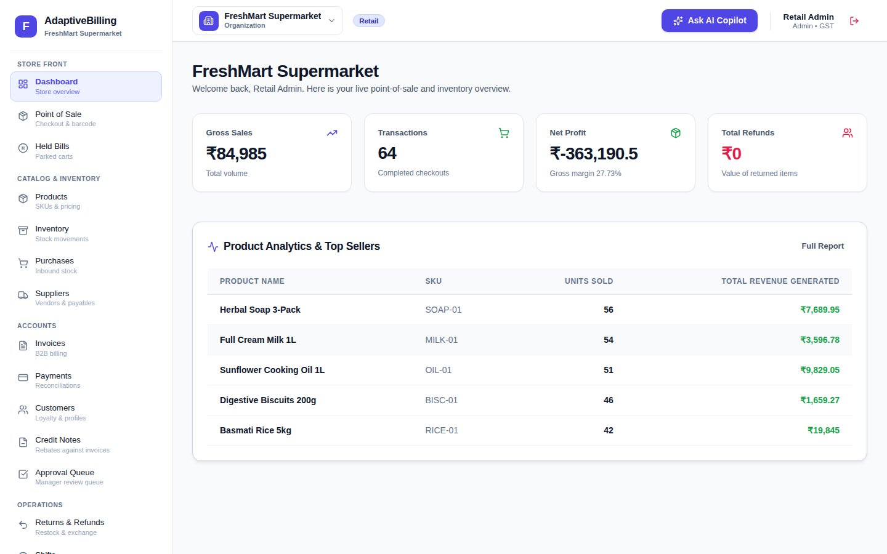
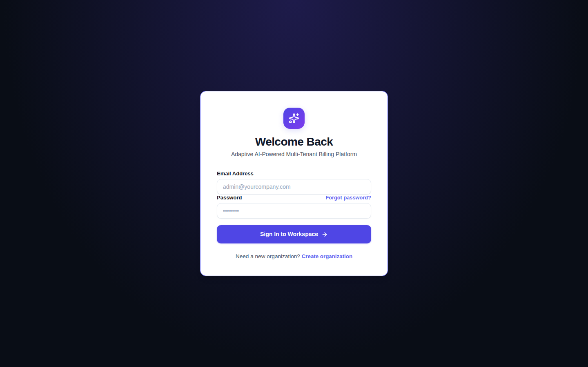
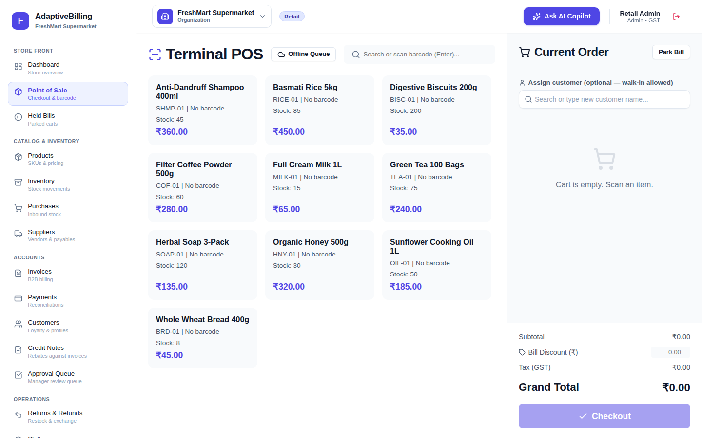
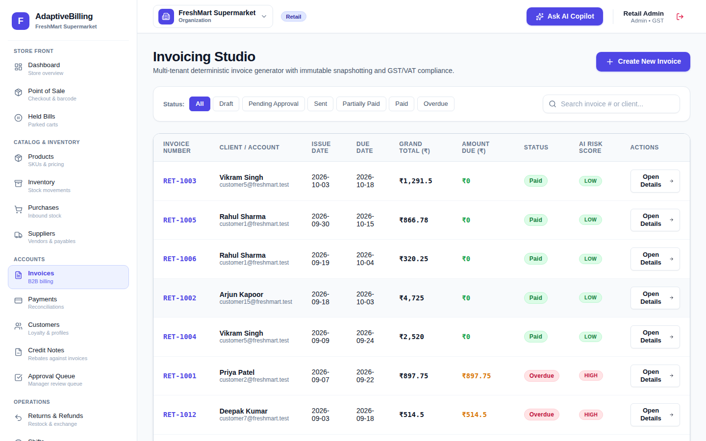
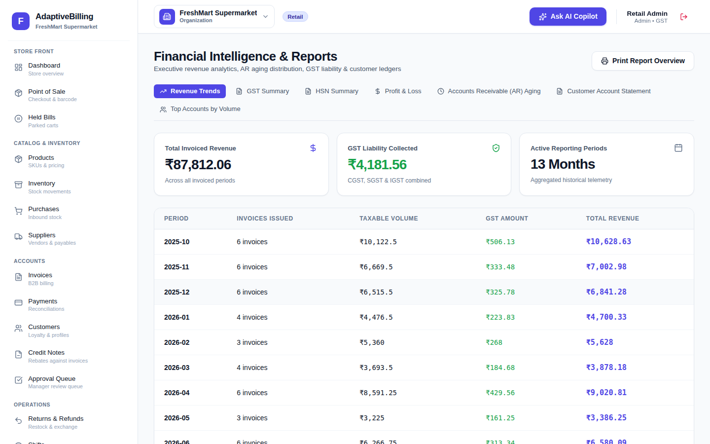

# Adaptive AI Billing Platform

[](https://www.typescriptlang.org/)
[](https://nodejs.org/)
[](https://react.dev/)
[](https://expressjs.com/)
[](https://www.mongodb.com/)

A multi-tenant billing, invoicing and retail point-of-sale platform written as a TypeScript monorepo (React + Express + MongoDB). One account can belong to several organizations; each organization picks a business type (retail, SaaS, agency/services or general) that decides which modules and screens it gets.



---

## Features

All of the following exist in the code and are exercised by the backend test suites unless noted.

**Tenancy and access**
- Organizations with per-organization memberships and roles: `admin`, `manager`, `accountant`, `sales`, `viewer`.
- Every protected request re-reads the user and membership, so role changes, deactivation and password resets take effect immediately.
- `viewer` is read-only across the API. Organization switching, invitations (existing accounts must accept), and per-organization module toggles.
- Session in an HttpOnly cookie (`billing_session`); `Authorization: Bearer` is also accepted. Origin-checked CSRF guard, CORS allow-list, MongoDB-backed rate limiting (global, login/reset and AI).
- Password reset by emailed single-use link (SMTP), audit log of sensitive actions.

**Billing**
- Invoice engine with line discounts, invoice discounts, GST (CGST/SGST vs IGST by state) or VAT, pricing tiers and atomic sequential invoice numbers.
- Invoice status state machine, payments with overpayment and concurrency guards, partial/cumulative refunds, credit notes, recurring invoice profiles (hourly cron, each period claimed atomically), invoice templates, PDF download (pdfkit) and email (nodemailer).
- Custom fields and business rules per organization (for example "invoice subtotal over 50,000 requires approval"); invoices held by a rule go to the **Approval Queue** for a manager to approve or reject.

**Retail / POS**
- Barcode-aware POS checkout in a MongoDB transaction (stock, split payments, store credit, loyalty, customer credit "udhaar"), server-side price enforcement, held bills, offline queue in IndexedDB with idempotent replay, thermal receipt printing via the browser.
- Inventory movements and adjustments, low-stock alerts, valuation, CSV product import, suppliers and purchases, returns with restocking, cash-drawer shifts, expenses.

**SaaS and agency**
- Plans and subscriptions; projects, timesheets and retainers (API plus SPA pages).

**Reports**
- Dashboard KPIs, revenue trends, AR aging, customer statements, top customers, profit & loss, best sellers, GST/HSN summary.

**AI assistance (optional)**
- Invoice copilot, "ask your business" Q&A, onboarding model suggestion, OCR document parsing, reminder and template generation.
- Uses Gemini or OpenAI when `GEMINI_API_KEY` / `OPENAI_API_KEY` is set; otherwise every AI endpoint returns a deterministic answer computed from the tenant's own data. No model accuracy claims are made.

**Backup**
- Admin-only JSON export of products, customers, invoices, payments, suppliers and purchases, and restore (upsert by SKU / email / name) inside a transaction.

---

## Screenshots

Captured from a local run against the seeded demo data (`admin@retail.test`). Figures such as the negative net profit come from the seed script's twelve months of sample expenses, not real data.

| Login | Point of sale |
| --- | --- |
|  |  |

| Invoices | Reports |
| --- | --- |
|  |  |

---

## Architecture

```
Browser (React 19 SPA, Vite)
   │  fetch /api/v1/*  (HttpOnly session cookie)
   ▼
Express API ── CORS allow-list → origin/CSRF guard → rate limiter
   │            → tenantMiddleware (JWT + live membership check) → requireModule / requireRole
   │            → module controller → billing engine / rule engine / AI provider
   ▼
MongoDB (Mongoose) — every document carries organizationId; money-moving flows use
multi-document transactions, so MongoDB must run as a replica set.
```

The API can also serve the built SPA (`frontend/dist`) from the same process, which is what the Docker image does.

### Project structure

```
adaptive-ai-billing-platform/
├── backend/src/
│   ├── app.ts, server.ts       # Express app factory and entry point
│   ├── config/                 # env loading/validation, MongoDB connection
│   ├── core/                   # tenancy, middleware, Zod schemas, audit, email, security, utils
│   ├── modules/<name>/         # routes + controllers (25 modules: auth, invoices, pos, ...)
│   ├── models/                 # Mongoose schemas
│   ├── billing-engine/         # invoice calculator, tax engine, numbering, model presets
│   ├── dynamic-engine/         # custom field validation, business rule evaluator
│   ├── ai/                     # LLM provider + deterministic fallbacks
│   ├── jobs/                   # node-cron scheduler, recurring invoices
│   ├── migrations/             # membership backfill
│   ├── seed.ts                 # demo tenants
│   └── tests/                  # API / integration suites (mongodb-memory-server)
├── frontend/
│   ├── src/                    # pages, components, context, api client, offline DB
│   └── e2e/                    # Playwright specs
├── shared/src/types/           # types and module constants shared by both sides
├── docs/                       # feature matrix, screenshots
├── Doc/                        # PRD / system design documents
├── docker-compose.yml          # local MongoDB (single-node replica set)
├── Dockerfile                  # API + built SPA image
└── render.yaml                 # Render blueprint (static SPA + Docker API)
```

---

## Getting started

### Prerequisites
- Node.js 20 or 22, npm 10
- MongoDB **running as a replica set** (MongoDB Atlas, or the provided Docker Compose service). Optional in development: without a reachable database the API starts an in-memory replica set with demo data.

### 1. Install
```bash
git clone https://github.com/ShibilAhamed701212/adaptive-ai-billing-platform.git
cd adaptive-ai-billing-platform
npm install
```

### 2. Start MongoDB (optional)
```bash
docker compose up -d --wait
```
This starts `mongo:7.0` as a single-node replica set (`rs0`) on port 27017 and initiates it on first start. A plain standalone `mongod` is not enough: POS checkout, payments, returns, stock adjustments and restores fail with "Transaction numbers are only allowed on a replica set member".

### 3. Configure
The API loads `.env` from its working directory, which is `backend/` when started through npm:
```bash
cp .env.example backend/.env
```

| Variable | Required | Purpose |
| --- | --- | --- |
| `PORT` | no (5001) | API port; the Vite dev proxy reads it from `backend/.env` too |
| `NODE_ENV` | no | `production` enables strict config checks, secure cookies and no demo data |
| `MONGODB_URI` | production | Replica-set connection string |
| `JWT_SECRET` | production | Random string of 32+ characters; development uses a random per-process secret if unset |
| `JWT_EXPIRES_IN` | no | Token lifetime (default `7d`) |
| `CLIENT_URL` | production | Comma-separated browser origins allowed by CORS; the first is used in reset links |
| `SMTP_HOST`, `SMTP_PORT`, `SMTP_USER`, `SMTP_PASS`, `SMTP_FROM` | no | Password-reset and invoice emails (reset links are logged to the console in development) |
| `GEMINI_API_KEY` / `OPENAI_API_KEY` | no | Enable LLM-backed AI features |
| `STRIPE_SECRET_KEY` | no | Only toggles the Stripe option of the test checkout; the Stripe provider is a stub |
| `VITE_API_URL` | frontend build | API origin for a separately hosted SPA (leave empty to use the dev proxy / same origin) |

In production the server refuses to start without a strong `JWT_SECRET`, `MONGODB_URI` and `CLIENT_URL`, and never creates demo accounts.

### 4. Seed demo data (development)
An empty development database is seeded automatically on first connection. To reset it explicitly:
```bash
npm run seed
```
Demo logins (development only; password `Admin@123456`): `admin@retail.test`, `admin@saas.test`, `admin@agency.test`, `admin@general.test`.

### 5. Run
```bash
npm run dev
```
- Frontend: http://localhost:5173 (proxies `/api` to the backend)
- API: http://localhost:5001, health at `/api/v1/health` (503 while the database is disconnected)

---

## API overview

All routes are under `/api/v1`, return `{ success, data }` or `{ success: false, error: { code, message } }`, and except for auth and `/health` require a session.

| Prefix | Purpose |
| --- | --- |
| `/auth` | register, login, logout, me, forgot/reset password |
| `/organizations` | my organizations, create, switch, invitations, profile, settings, billing model |
| `/users` | team list, add/invite, update role/status |
| `/customers`, `/products` | CRUD, customer account payments, barcode lookup, CSV import |
| `/invoices` | list, preview, create, update draft, status, PDF, email, cancel |
| `/payments`, `/credit-notes`, `/recurring`, `/invoice-templates`, `/approvals` | money flow and review |
| `/pos`, `/inventory`, `/suppliers`, `/purchases`, `/returns`, `/shifts`, `/expenses` | retail operations |
| `/saas`, `/agency` | plans/subscriptions; projects/timesheets/retainers |
| `/reports`, `/audit-logs`, `/dynamic`, `/ai`, `/system` | analytics, audit trail, custom fields & rules, AI, backup/restore |

Several modules are gated by `requireModule(...)` (the organization must have the module enabled) and by role.

---

## Testing

```bash
npm test                                   # invoice calculator unit tests
npm run test:all --workspace=backend       # every backend suite below
```

| Script (`--workspace=backend`) | Covers |
| --- | --- |
| `test` | invoice calculator, tax and pricing tiers |
| `test:auth` | membership revocation invalidates sessions |
| `test:hardening` | production config, CSRF, password reset, rate limits, approvals, AI input limits |
| `test:approvals` | rule-held invoices reach the approval queue, sales-role permissions, concurrent refunds |
| `test:integration` | 11 POS/inventory/shift/return scenarios, tenant isolation, rollback |
| `test:pos` | atomic POS sale and overselling |
| `test:saas` | multi-tenant SaaS flow, invitations, recurring runs (29 checks) |
| `test:audit` | money-flow logic audit (31 checks) |

The API suites start a throwaway in-memory MongoDB via `mongodb-memory-server` (downloaded on first run), so no database setup is needed. CI (`.github/workflows/ci-cd.yml`) builds all workspaces and runs every suite on pushes and pull requests to `main`.

Playwright specs in `frontend/e2e` need the frontend, API and seeded demo data running: `npm run test:e2e --workspace=frontend`. They are not run in CI.

---

## Deployment

- **Docker**: `docker build -t adaptive-billing .` produces an image that serves the API and the built SPA on port 10000 as a non-root user. Provide the production variables above.
- **Render**: `render.yaml` defines a static site for the SPA and a Docker web service for the API with `JWT_SECRET` generated and `MONGODB_URI`/SMTP values set in the dashboard. `frontend/.env.production` and the blueprint point at `https://adaptive-billing-api.onrender.com`; change both if you deploy under another name.

---

## Known limitations

- The Stripe payment provider is a stub; only the sandbox test checkout records payments. There is no payment-gateway webhook flow.
- Business rules are evaluated when an invoice is created. Editing a draft afterwards does not re-run them.
- Only `require_approval` and `set_field` rule actions change the saved invoice; `apply_discount` and `add_surcharge` are reported in `ruleEffects` but not applied to totals.
- Refunds and the sandbox checkout update the invoice with read-modify-write; a refund racing a new payment on the same invoice can lose one of the two invoice updates (the payment record itself is guarded).
- The session lasts 7 days with no refresh-token rotation; logout clears the cookie but does not revoke the token server-side (password changes and membership changes do).
- The frontend bundle is a single ~850 kB chunk (Vite warns); no ESLint configuration is present.
- `npm audit` reports high-severity advisories in Tailwind CSS 3's build-time file watcher chain (`braces`/`micromatch`); fixing them requires Tailwind 4. Production dependencies report no known vulnerabilities.

See [PROJECT_HEALTH_REPORT.md](PROJECT_HEALTH_REPORT.md) for the audit history and fixed bugs.

---

## License

ISC. Built by [Shibil Ahamed](https://github.com/ShibilAhamed701212).
